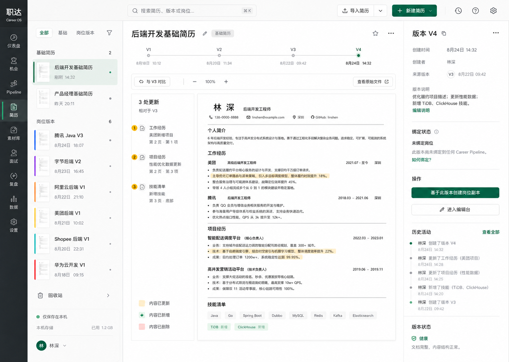

# 职达 V2 简历库 Version Studio 设计规格

Status: Approved visual target

Date: 2026-08-25

Owner: Core Controller

## 1. 权威设计目标

实现以仓库内设计图为视觉基线：



- 文件：`docs/design/v2-resume-library-version-studio-target.png`
- 尺寸：1486 × 1058
- SHA-256：`b9d118bb4edfb1505f6b05bd42575ef94686a15b9d32ed5921a5f01559ee3860`

目标图冻结的是页面的信息层级、空间关系、视觉重心和交互入口，不冻结示例姓名、公司、日期、正文、版本数量和更新数量。所有业务内容必须来自当前用户的真实本地数据，无法得到时使用诚实空状态，禁止把图中文字写死进组件。

本规格补充但不替代领域契约：`docs/superpowers/specs/2026-08-25-resume-interview-workspace-contract.md`。领域契约发生冲突时，以领域契约为准。

## 2. 页面定位

简历库不是文件缩略图书架，也不是完整编辑器。它是用户理解和管理以下关系的桌面版本工作室：

```text
ResumeAsset（独立简历资产）
  └─ ResumeVersion（同资产内不可变线性版本）
       └─ 用户显式 fork → 新的 JOB_EXPRESSION ResumeAsset + V1
```

页面必须帮助用户完成四件事：

1. 在通用简历与岗位表达副本之间快速切换；
2. 查看同一资产的版本历史并理解当前版本；
3. 预览版本内容和相对上一版本的真实变化；
4. 进入编辑台，或从选定版本显式创建岗位表达副本。

页面不得暗示切换 Pipeline 会自动切换简历，也不得把 V1、V2、V3 当成三份独立简历。

## 3. 整体空间模型

桌面宽屏采用四层结构：

```text
全局 DesktopShell | 资产导航 | 版本工作区                         | 版本检查器
现有导航，不重做   | 240–280px | minmax(560px, 1fr)              | 260–300px
```

### 3.1 全局壳层

- 继续使用现有 `DesktopShell.vue`、主题切换和导航路由；本任务不重画全局导航。
- 设计图中的全局左栏只用于表达最终产品氛围，不授权修改其他模块入口、名称或图标。
- 页面背景、文字、边框、选中态和品牌色必须消费现有语义 token，不得硬编码仅浅色可用的颜色。

### 3.2 页面顶栏

- 高度建议 52–60px，跨资产导航、工作区和检查器保持一条连续水平基线。
- 搜索框位于页面内容区左上，可检索简历标题；不得把正文或联系方式写入搜索日志。
- 右侧只保留“导入简历”“新建简历”两个主要入口；刷新不作为高权重永久按钮，可进入溢出菜单或由重试状态提供。
- 不使用大标题横幅、说明副标题或空旷欢迎区。

## 4. 资产导航区

### 4.1 顶部过滤

- 提供 `全部 / 通用 / 岗位版本` 三个过滤项，归档通过独立入口或溢出菜单进入。
- 过滤只改变资产集合，不改变 Pipeline、编辑器或面试上下文。
- 当前过滤使用轻量绿色文字/底线或浅选中面，不使用大胶囊。

### 4.2 分组与数量

- `基础简历` 对应 `GENERAL`；`岗位版本` 对应 `JOB_EXPRESSION`。
- 每组标题右侧展示真实资产数量。
- 同一资产的 V1/V2/V3 不重复进入资产列表。

### 4.3 资产行

每行只展示：

- 小型真实简历纸张缩略图或稳定的文档图标；
- 资产标题；
- 当前版本号；
- 最近更新时间；
- 岗位表达副本使用克制的区分色或来源标记。

选中行使用窄色条、浅背景和清晰文字权重。禁止使用大卡片、浮夸阴影、完整简历缩略图和纯装饰公司 Logo。键盘上下键可移动选择，`Enter` 打开。

### 4.4 底部状态

- 展示“仅保存在本机”及真实可得的本地状态；不得伪造存储容量。
- 回收站/归档入口必须明确是归档资产，不表示物理删除版本。

## 5. 中央版本工作区

### 5.1 资产身份栏

- 展示资产标题、`通用简历` 或 `岗位表达` 类型以及改名入口。
- 类型是事实标签，不使用醒目营销徽章。
- 收藏、溢出操作仅在已有真实行为时显示；没有行为不得摆设图标。

### 5.2 紧凑版本轨道

本次批准的关键修改是放弃大白色圆圈：

- 轨道整体高度控制在 70–96px；不得挤压正文画布。
- 版本使用 8–10px 小节点和细线表示不可变线性历史。
- `V1…Vn` 以 12–13px 标签展示；日期使用弱一层文本。
- 选中版本只使用绿色实心节点、稍强字重和小范围状态提示，不使用大光环。
- 历史节点使用中性灰；版本很多时允许横向滚动、首尾跳转或折叠中间节点，不换成多行大时间线。
- 点击历史版本切换为只读预览，不改变 `currentVersionId`。
- 轨道顺序必须按 `versionNo` 单调递增，不能依赖接口返回顺序。

### 5.3 比较工具条

- 选中 V2 及以上时提供“与 V(n-1) 对比”；V1 显示“初始版本”，不制造对比结果。
- 比较开关、缩放和“查看原始版本”处于同一紧凑工具条。
- 对比只基于两个真实 `ResumeVersion.content` 计算，不调用 AI，不创建版本。

### 5.4 变化摘要边栏

- 位于正文左侧，宽约 150–190px，可折叠。
- 展示真实的章节级变化：新增、修改、删除，以及对应章节名称。
- 变化颜色语义固定：修改为柔和琥珀、新增为绿色、删除为低饱和红色；颜色之外同时提供图标/文字。
- 无变化时显示“与上一版本内容一致”，不能写死“3 处更新”。
- 首个版本显示“初始版本，无上一版本可比较”。

### 5.5 简历正文画布

- 是全页视觉主体，宽度优先于左侧变化摘要和右侧检查器。
- 使用真实结构化 `ResumeContent` 生成稳定纸张预览，保持与编辑台相同的章节顺序和隐藏章节规则。
- 画布只读；点击正文不得直接修改。
- 比较模式只高亮真实变化片段。无法可靠做到字段级差异时，先实现章节级高亮，禁止伪造精确词级 diff。
- 联系方式只显示给本机当前用户，不进入埋点、控制台或测试快照。
- 空内容显示可执行空状态“进入编辑台补充内容”，不展示示例简历。

## 6. 右侧版本检查器

### 6.1 版面

- 宽 260–300px，使用分段和细分隔线，不堆叠卡片。
- 宽度不足时可关闭并由工具栏按钮重新打开；关闭后中央正文占用释放空间。

### 6.2 版本信息

展示真实可得字段：

- `版本 Vn`；
- 创建时间；
- 创建来源：手工、导入、AI 建议或 fork；
- 同资产父版本；
- `changeSummary`；
- 若资产为岗位表达副本，展示跨资产来源版本。

API 没有用户显示名时使用“手工保存”等来源名称，不照图写死作者姓名。

### 6.3 引用状态

- 展示哪些 Pipeline 明确绑定了当前 `resumeVersionId`。
- 若当前公开接口无法提供 Interview 引用，显示“面试引用暂不可查询”或暂不展示该分组，禁止推断。
- “未绑定岗位”只在真实反查为空时出现。
- 点击引用跳转到对应模块，但不得在此页面自动改绑。

### 6.4 操作层级

- 当前版本：主操作“进入编辑台”，次操作“基于此版本创建岗位副本”。
- 历史版本：主操作“基于此版本创建岗位副本”，只读查看为默认；不得允许普通保存形成同资产分支。
- 岗位表达资产仍可从其版本再次 fork，但弹窗必须明确来源，避免用户误以为同步源资产。
- 归档、改名等低频操作进入溢出菜单，并拥有确认、loading、错误和重试状态。

### 6.5 历史活动与状态

- 活动只来自真实版本创建、改名、fork、归档/恢复等事件；没有事件 API 时不写静态活动流。
- “版本健康”只能表达确定性结构检查，例如正文可读取、必要字段缺失；不得表示 AI 总分或能力评分。

## 7. 新建、导入和 fork

### 7.1 新建简历

- 创建 `GENERAL` 资产和 V1，然后进入编辑台。
- 标题为空时使用明确校验，不自动使用用户姓名或岗位猜测标题。

### 7.2 导入简历

- 保留现有 Markdown 解析确认流程；确认前不得创建资产。
- PDF/DOCX 若当前没有可靠解析契约，只展示真实支持范围，不放置可点击假入口。

### 7.3 创建岗位表达副本

- 弹窗显示源资产、源版本 Vn、新标题和“创建后独立演进”的说明。
- renderer 只提交源 `versionId` 和新标题；正文由服务端复制。
- 成功后选中新资产 V1；失败保留原资产和用户输入，不生成临时假 ID。

## 8. 状态与响应式边界

### 8.1 必须覆盖的状态

- 首次空库；
- 列表加载、版本加载；
- 列表失败、版本失败和独立重试；
- 资产无正文；
- 只有 V1；
- 多于 8 个版本；
- GENERAL 与 JOB_EXPRESSION；
- 无引用与多 Pipeline 引用；
- fork/改名/归档 loading 与失败；
- 归档列表与恢复。

### 8.2 宽度策略

- `>= 1280px`：资产导航、中央工作区、检查器同时显示。
- `1024–1279px`：检查器默认收窄或关闭，中央正文保持可读；资产导航保持约 220px。
- `< 1024px`：资产导航改为可打开的侧面板，检查器使用抽屉；不把四栏按比例压扁。
- 最小支持窗口以桌面发行基线为准；任何宽度都不得产生页面级横向滚动，版本轨道自身可横向滚动。

### 8.3 主题

- 目标图是浅色权威稿；暗色必须保持同一层级而非颜色反转截图。
- 消费 `--canvas`、`--surface-*`、`--ink`、`--copy`、`--muted`、`--line*`、`--brand`、`--warning`、`--danger` 等语义 token。
- 公司/来源色只用于小面积识别，不能破坏黑白/石墨主体系。

## 9. 动效与可访问性

- 资产选择、版本切换和检查器开合使用 120–180ms 的位移/透明度过渡。
- 正文切换不得先清空后闪烁；保留画布骨架并展示局部 loading。
- 支持 `prefers-reduced-motion`，关闭非必要动画。
- 所有图标按钮拥有中文 `aria-label`；选中资产和版本使用 `aria-current` 或 `aria-selected`。
- 焦点顺序：搜索 → 过滤 → 资产列表 → 版本轨道 → 比较工具 → 正文 → 检查器操作。
- 文本和状态对比度满足 WCAG AA；变化类型不能只靠颜色表达。

## 10. 组件边界建议

```text
ResumeLibraryView.vue                页面编排、路由、空/错状态
components/resume-library/
  ResumeAssetNavigator.vue          过滤、分组、资产选择
  ResumeAssetHeader.vue             资产身份与低频菜单
  ResumeVersionRail.vue             紧凑线性版本轨道
  ResumeCompareToolbar.vue          对比与预览工具
  ResumeChangeSummary.vue           确定性章节差异摘要
  ResumeDocumentPreview.vue         结构化只读正文
  ResumeVersionInspector.vue        元数据、引用和操作
  ResumeForkDialog.vue              fork 确认流程
utils/resumeVersionDiff.ts          纯函数、无 AI 的版本差异
```

组件名称可按现有实现轻微调整，但责任不得重新堆回 `ResumeLibraryView.vue`。

## 11. 明确禁止

- 把目标图示例数据写死；
- 把版本做成大白圆、大时间线或多行卡片；
- 资产切换自动切换 Pipeline、面试或编辑器上下文；
- 历史版本直接保存为同资产新分支；
- 在库页复制完整编辑器；
- 用 AI 生成或猜测变化、引用、作者、健康度和正文；
- 为贴图修改全局导航、Knowledge、Pipeline、Schedule、Interview 或 Workspace；
- 引入新的 UI 框架或全局颜色系统。

## 12. 验收标准

### 功能验收

1. 通用简历和岗位表达副本清晰分组，版本不会重复为资产。
2. 选择资产后版本轨道、正文和检查器同步到同一真实对象。
3. 点击历史版本只读展示，不改变 currentVersionId。
4. 版本轨道小节点不抢正文；多版本仍可访问。
5. 对比结果由两个真实版本确定性生成；无变化和 V1 状态诚实。
6. fork 后产生独立资产 V1，源资产与 Pipeline 绑定均不变化。
7. 当前/历史版本的主操作符合本规格，不形成同资产分支。
8. 归档、恢复、失败、重试和空状态可完成真实流程。

### 视觉验收

1. 1440×1024 截图与目标图并排审查：中央正文是第一视觉主体。
2. 资产导航与检查器保持窄栏，不能共同挤压正文到不可读。
3. 版本轨道高度不超过 96px，节点直径不超过 10px（选中态视觉外框不超过 16px）。
4. 页面主要区块依靠对齐、间距和细分隔线组织，不出现卡片套卡片。
5. 浅色与暗色在 1440px、1280px、1024px 三档无裁切、重叠和页面级横向滚动。
6. 目标图之外的所有数字、标题、正文和状态均来自测试夹具或真实 API。
