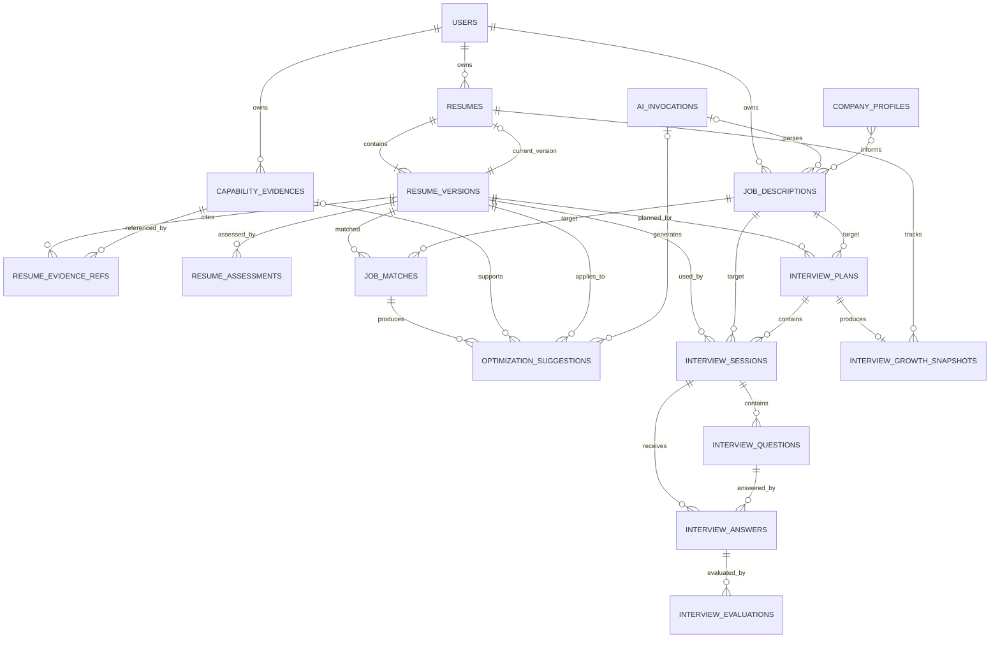

# 职达数据模型设计（评审草案）

> 状态：Draft  
> 适用范围：Sprint 1—Sprint 3
> 数据库：MySQL 8  
> 说明：本文件是 AI 辅助整理的设计草案。课程要求数据模型由团队人工主导，三名成员
> 必须逐项审阅、修改并在文末确认后，才能将状态改为 `Accepted`。

## 1. 设计目标

数据模型必须支持：

1. 用户事实先进入能力证据库；
2. 简历的每次修改产生不可变版本；
3. 评分与匹配结果能够追溯到输入版本和算法版本；
4. AI 修改建议能够追溯到岗位要求和能力证据；
5. AI 失败或用户拒绝建议时不修改原简历；
6. AI 调用可审计，但日志不保存不必要的敏感原文；
7. Sprint 2 支持真实岗位数据的扩展信息暂存；
8. Sprint 2 支持简历建议采纳后生成新版本；
9. Sprint 2 支持模拟面试会话、问题、回答和评价记录；
10. Sprint 3 支持“一次多轮面试”的计划容器、整次复盘和成长趋势快照；
11. Sprint 3 支持公司偏好 Profile 作为 AI 建议上下文，但不参与评分、排序或录用概率判断。

## 2. Sprint 1 假设

- Sprint 1 使用固定演示用户，不实现注册登录；通过统一当前用户接口取得种子用户 ID。
- Sprint 1 只支持结构化录入，不支持 PDF/Word 简历导入。
- 一名用户可以有多份简历和多个目标岗位。
- 一份简历有多个不可变版本，只有 `resumes.current_version_id` 指向当前版本。
- 能力证据独立于简历版本，可以被多个版本引用。
- 简历正文和 AI 结构化结果使用 JSON 保存快照；需要查询和约束的状态单独建列。
- 技能标签在 Sprint 1 使用 JSON 数组，不提前建设完整技能知识库。
- 所有时间以 UTC 写入数据库，API 使用 ISO 8601。
- Sprint 2 岗位数据采用“原文优先、核心抽取、扩展暂存”，不为真实岗位中的每类字段都新增独立列。
- Sprint 2 模拟面试状态机属于 AI 禁飞区，状态流转由人工规则决定。
- Sprint 3 的面试计划层只组织多个 session，不定义或修改状态机转换。
- Sprint 3 的成长趋势只消费已保存的 AI 评价分数，不产生简历评分和岗位排序结果。

这些假设由团队评审后才能成为正式设计。

## 3. 核心实体关系



## 4. 表设计

### 4.1 `users`

Sprint 1 只提供最小用户归属，不在这里建设完整认证。

| 字段 | 类型 | 约束 | 说明 |
|---|---|---|---|
| `id` | BIGINT UNSIGNED | PK, AUTO_INCREMENT | 用户 ID |
| `display_name` | VARCHAR(100) | NOT NULL | 展示名称 |
| `created_at` | DATETIME(3) | NOT NULL | 创建时间 |
| `updated_at` | DATETIME(3) | NOT NULL | 更新时间 |

### 4.2 `capability_evidences`

用户事实的唯一来源。AI 可以改善表达，不能改变这里记录的事实。

| 字段 | 类型 | 约束 | 说明 |
|---|---|---|---|
| `id` | BIGINT UNSIGNED | PK, AUTO_INCREMENT | 证据 ID |
| `user_id` | BIGINT UNSIGNED | FK, NOT NULL | 所属用户 |
| `evidence_type` | VARCHAR(32) | NOT NULL | project/internship/competition/skill/other |
| `title` | VARCHAR(200) | NOT NULL | 经历标题 |
| `situation` | TEXT | NULL | 背景与任务 |
| `action_text` | TEXT | NOT NULL | 用户实际完成的行动 |
| `result_text` | TEXT | NULL | 结果及量化指标 |
| `skill_tags` | JSON | NOT NULL | 技能标签数组 |
| `source_note` | VARCHAR(500) | NULL | 证书、链接等来源说明 |
| `created_at` | DATETIME(3) | NOT NULL | 创建时间 |
| `updated_at` | DATETIME(3) | NOT NULL | 更新时间 |
| `deleted_at` | DATETIME(3) | NULL | 软删除时间 |

约束：

- `skill_tags` 必须是字符串数组；
- 被简历版本引用的证据不能物理删除；
- `action_text` 不允许为空；
- AI 不能自动写回或覆盖事实字段。

### 4.3 `resumes`

简历聚合根，只保存身份和当前版本指针。

| 字段 | 类型 | 约束 | 说明 |
|---|---|---|---|
| `id` | BIGINT UNSIGNED | PK, AUTO_INCREMENT | 简历 ID |
| `user_id` | BIGINT UNSIGNED | FK, NOT NULL | 所属用户 |
| `title` | VARCHAR(200) | NOT NULL | 简历名称 |
| `current_version_id` | BIGINT UNSIGNED | FK, NULL | 当前版本 |
| `created_at` | DATETIME(3) | NOT NULL | 创建时间 |
| `updated_at` | DATETIME(3) | NOT NULL | 更新时间 |
| `deleted_at` | DATETIME(3) | NULL | 软删除时间 |

`current_version_id` 在首个版本创建后写入。更新当前版本必须和新版本创建处于同一事务。

### 4.4 `resume_versions`

不可变简历快照。已创建的版本不执行 UPDATE，修改必须创建下一版本。

| 字段 | 类型 | 约束 | 说明 |
|---|---|---|---|
| `id` | BIGINT UNSIGNED | PK, AUTO_INCREMENT | 版本 ID |
| `resume_id` | BIGINT UNSIGNED | FK, NOT NULL | 所属简历 |
| `parent_version_id` | BIGINT UNSIGNED | FK, NULL | 来源版本 |
| `version_no` | INT UNSIGNED | NOT NULL | 递增版本号 |
| `content_json` | JSON | NOT NULL | 完整简历快照 |
| `change_summary` | VARCHAR(500) | NULL | 修改摘要 |
| `created_by_type` | VARCHAR(32) | NOT NULL | user/ai_suggestion/import |
| `created_at` | DATETIME(3) | NOT NULL | 创建时间 |

索引与约束：

- `UNIQUE(resume_id, version_no)`；
- `parent_version_id` 必须属于同一份简历；
- `content_json` 至少包含基本信息、教育、经历和技能节点；
- 不记录 `updated_at`，强调版本不可变。

### 4.5 `resume_evidence_refs`

记录某个简历版本中的内容引用了哪些能力证据。

| 字段 | 类型 | 约束 | 说明 |
|---|---|---|---|
| `id` | BIGINT UNSIGNED | PK, AUTO_INCREMENT | 引用 ID |
| `resume_version_id` | BIGINT UNSIGNED | FK, NOT NULL | 简历版本 |
| `evidence_id` | BIGINT UNSIGNED | FK, NOT NULL | 能力证据 |
| `section_key` | VARCHAR(100) | NOT NULL | 简历节点标识 |
| `created_at` | DATETIME(3) | NOT NULL | 创建时间 |

约束：`UNIQUE(resume_version_id, evidence_id, section_key)`。

### 4.6 `job_descriptions`

保存用户输入的 JD 和经过 Schema 校验的解析结果。

| 字段 | 类型 | 约束 | 说明 |
|---|---|---|---|
| `id` | BIGINT UNSIGNED | PK, AUTO_INCREMENT | JD ID |
| `user_id` | BIGINT UNSIGNED | FK, NOT NULL | 所属用户 |
| `job_title` | VARCHAR(200) | NOT NULL | 岗位名称 |
| `company_name` | VARCHAR(200) | NULL | 公司名称 |
| `raw_text` | MEDIUMTEXT | NOT NULL | 用户输入的 JD |
| `parsed_json` | JSON | NULL | 结构化岗位要求 |
| `source_meta_json` | JSON | NULL | Sprint 2 真实岗位来源和扩展信息 |
| `parse_status` | VARCHAR(32) | NOT NULL | pending/succeeded/failed |
| `prompt_version` | VARCHAR(50) | NULL | 解析 Prompt 版本 |
| `parse_ai_invocation_id` | BIGINT UNSIGNED | FK, NULL | 成功解析对应的 AI 调用 |
| `created_at` | DATETIME(3) | NOT NULL | 创建时间 |
| `updated_at` | DATETIME(3) | NOT NULL | 更新时间 |

解析失败时保留 `raw_text`，`parsed_json` 为空，不删除用户输入。

Sprint 2 `source_meta_json` 建议结构：

```json
{
  "base": "武汉",
  "salary": "150-200元/天",
  "platform": "牛客",
  "sourceUrl": "https://example.com/job/xxx",
  "industry": "互联网",
  "workType": "实习",
  "companySize": "500-999人",
  "collectedAt": "2026-07-09",
  "tags": ["Java", "后端", "实习"]
}
```

规则：

- `source_meta_json` 只用于真实感展示、来源追溯和后续扩展；
- Sprint 2 匹配算法只读取 `parsed_json` 中的必备技能、加分技能、职责、经验和学历要求；
- base、薪资、行业、来源链接等扩展字段暂不参与匹配得分；
- 不为每个外部数据源字段单独建列，避免过早建设岗位平台。

### 4.7 `resume_assessments`

保存禁飞区评分算法的结果，不保存模型主观评分。

| 字段 | 类型 | 约束 | 说明 |
|---|---|---|---|
| `id` | BIGINT UNSIGNED | PK, AUTO_INCREMENT | 评分 ID |
| `resume_version_id` | BIGINT UNSIGNED | FK, NOT NULL | 被评分版本 |
| `rule_version` | VARCHAR(50) | NOT NULL | 评分规则版本 |
| `total_score` | DECIMAL(5,2) | NOT NULL | 0—100 |
| `dimension_scores` | JSON | NOT NULL | 各维度得分 |
| `deductions` | JSON | NOT NULL | 扣分项及原因 |
| `input_fingerprint` | CHAR(64) | NOT NULL | 输入摘要，用于复现与去重 |
| `created_at` | DATETIME(3) | NOT NULL | 创建时间 |

约束：

- `CHECK(total_score >= 0 AND total_score <= 100)`；
- `UNIQUE(resume_version_id, rule_version, input_fingerprint)`；
- 权重配置由评分模块的人工规则版本管理。

### 4.8 `job_matches`

保存禁飞区匹配算法对一个简历版本和一个 JD 的确定性结果。

| 字段 | 类型 | 约束 | 说明 |
|---|---|---|---|
| `id` | BIGINT UNSIGNED | PK, AUTO_INCREMENT | 匹配 ID |
| `resume_version_id` | BIGINT UNSIGNED | FK, NOT NULL | 简历版本 |
| `job_description_id` | BIGINT UNSIGNED | FK, NOT NULL | 目标 JD |
| `algorithm_version` | VARCHAR(50) | NOT NULL | 匹配算法版本 |
| `match_score` | DECIMAL(5,2) | NOT NULL | 0—100 |
| `details_json` | JSON | NOT NULL | 必备项、加分项、经验和未知项 |
| `input_fingerprint` | CHAR(64) | NOT NULL | 输入摘要 |
| `created_at` | DATETIME(3) | NOT NULL | 创建时间 |

约束：

- `CHECK(match_score >= 0 AND match_score <= 100)`；
- `UNIQUE(resume_version_id, job_description_id, algorithm_version, input_fingerprint)`；
- 对相同输入和算法版本返回同一结果；
- 模型解析结果只是算法输入，不能直接成为 `match_score`。

### 4.9 `optimization_suggestions`

一条建议对应一个可独立采纳或拒绝的修改。

| 字段 | 类型 | 约束 | 说明 |
|---|---|---|---|
| `id` | BIGINT UNSIGNED | PK, AUTO_INCREMENT | 建议 ID |
| `job_match_id` | BIGINT UNSIGNED | FK, NOT NULL | 来源匹配 |
| `resume_version_id` | BIGINT UNSIGNED | FK, NOT NULL | 适用简历版本 |
| `evidence_id` | BIGINT UNSIGNED | FK, NULL | 来源能力证据 |
| `section_key` | VARCHAR(100) | NOT NULL | 建议修改的位置 |
| `original_text` | TEXT | NOT NULL | 原文 |
| `suggested_text` | TEXT | NULL | 建议文本 |
| `reason_text` | TEXT | NOT NULL | 建议原因 |
| `target_requirement` | TEXT | NOT NULL | 对应 JD 要求 |
| `status` | VARCHAR(32) | NOT NULL | pending/accepted/rejected/evidence_required |
| `prompt_version` | VARCHAR(50) | NOT NULL | Prompt 版本 |
| `generation_ai_invocation_id` | BIGINT UNSIGNED | FK, NOT NULL | 生成建议对应的 AI 调用 |
| `accepted_version_id` | BIGINT UNSIGNED | FK, NULL | 采纳后产生的版本 |
| `created_at` | DATETIME(3) | NOT NULL | 创建时间 |
| `decided_at` | DATETIME(3) | NULL | 用户决定时间 |

规则：

- 没有事实证据时，`status=evidence_required` 且 `suggested_text` 为空；
- 同一条建议只能从 `pending` 转换一次；
- 采纳建议和创建新版本必须在同一事务中完成；
- 重复请求使用幂等键避免创建多个相同版本。

### 4.10 Sprint 2 简历版本迭代补充

当前 `resume_versions` 已有 `parent_version_id` 和 `change_summary`，可以承载“来源版本”和“修改摘要”。

Sprint 2 为了追踪“由哪条 AI 建议生成”，建议补充以下字段：

| 字段 | 类型 | 约束 | 说明 |
|---|---|---|---|
| `applied_suggestion_id` | BIGINT UNSIGNED | FK, NULL | 生成该版本时采纳的建议 |

规则：

- 如果版本由用户手工创建，`applied_suggestion_id` 为空；
- 如果版本由 AI 建议采纳产生，`created_by_type=ai_suggestion`；
- 同一建议只能绑定一个被采纳版本；
- 创建新版本后，需要同步写回 `optimization_suggestions.accepted_version_id`。

### 4.11 `ai_invocations`

只保存调用元数据和质量信息，不默认保存完整输入输出。

| 字段 | 类型 | 约束 | 说明 |
|---|---|---|---|
| `id` | BIGINT UNSIGNED | PK, AUTO_INCREMENT | 调用 ID |
| `request_id` | VARCHAR(64) | UNIQUE, NOT NULL | 请求关联 ID |
| `user_id` | BIGINT UNSIGNED | FK, NULL | 匿名或演示用户 |
| `feature_type` | VARCHAR(50) | NOT NULL | jd_parse/resume_optimize 等 |
| `provider` | VARCHAR(50) | NOT NULL | aliyun-bailian |
| `model_name` | VARCHAR(100) | NOT NULL | 实际模型标识 |
| `prompt_version` | VARCHAR(50) | NOT NULL | Prompt 版本 |
| `status` | VARCHAR(32) | NOT NULL | succeeded/failed/degraded |
| `latency_ms` | INT UNSIGNED | NULL | 调用耗时 |
| `schema_valid` | BOOLEAN | NULL | Schema 是否通过 |
| `input_tokens` | INT UNSIGNED | NULL | 输入 Token |
| `output_tokens` | INT UNSIGNED | NULL | 输出 Token |
| `error_category` | VARCHAR(50) | NULL | timeout/rate_limit/invalid_json 等 |
| `created_at` | DATETIME(3) | NOT NULL | 创建时间 |

禁止保存：

- API Key 和 Authorization Header；
- 完整手机号、邮箱；
- 未脱敏的完整简历；
- 未经明确同意的完整模型输入输出。

### 4.12 `interview_sessions`

保存一次模拟面试会话。状态机流转属于 AI 禁飞区。

| 字段 | 类型 | 约束 | 说明 |
|---|---|---|---|
| `id` | BIGINT UNSIGNED | PK, AUTO_INCREMENT | 面试会话 ID |
| `user_id` | BIGINT UNSIGNED | FK, NOT NULL | 所属用户 |
| `resume_version_id` | BIGINT UNSIGNED | FK, NOT NULL | 使用的简历版本 |
| `job_description_id` | BIGINT UNSIGNED | FK, NOT NULL | 目标岗位 |
| `status` | VARCHAR(32) | NOT NULL | READY/ASKING/WAITING_ANSWER/EVALUATING/NEXT_QUESTION/SUMMARIZING/COMPLETED/FAILED/CANCELLED |
| `current_question_index` | INT UNSIGNED | NOT NULL | 当前题号，从 1 开始 |
| `total_questions` | INT UNSIGNED | NOT NULL | S2 固定为 3 |
| `summary_json` | JSON | NULL | 面试总结和改进建议 |
| `started_at` | DATETIME(3) | NULL | 开始时间 |
| `completed_at` | DATETIME(3) | NULL | 完成时间 |
| `created_at` | DATETIME(3) | NOT NULL | 创建时间 |
| `updated_at` | DATETIME(3) | NOT NULL | 更新时间 |

规则：

- `status` 只能按人工状态转换表变化；
- AI 不允许决定 `status`、`current_question_index` 或 `completed_at`；
- `COMPLETED`、`FAILED`、`CANCELLED` 后不允许继续提交回答。

### 4.13 `interview_questions`

保存面试问题。问题文本可以由 AI 生成，但题号和状态推进由程序控制。

| 字段 | 类型 | 约束 | 说明 |
|---|---|---|---|
| `id` | BIGINT UNSIGNED | PK, AUTO_INCREMENT | 问题 ID |
| `session_id` | BIGINT UNSIGNED | FK, NOT NULL | 面试会话 |
| `question_index` | INT UNSIGNED | NOT NULL | 第几题 |
| `question_text` | TEXT | NOT NULL | 问题文本 |
| `question_type` | VARCHAR(50) | NULL | project_experience/skill/jd_requirement 等 |
| `target_skill` | VARCHAR(100) | NULL | 目标技能 |
| `generation_ai_invocation_id` | BIGINT UNSIGNED | FK, NULL | 生成问题的 AI 调用 |
| `created_at` | DATETIME(3) | NOT NULL | 创建时间 |

约束：`UNIQUE(session_id, question_index)`。

### 4.14 `interview_answers`

保存用户回答。

| 字段 | 类型 | 约束 | 说明 |
|---|---|---|---|
| `id` | BIGINT UNSIGNED | PK, AUTO_INCREMENT | 回答 ID |
| `session_id` | BIGINT UNSIGNED | FK, NOT NULL | 面试会话 |
| `question_id` | BIGINT UNSIGNED | FK, NOT NULL | 对应问题 |
| `answer_text` | TEXT | NOT NULL | 用户回答 |
| `created_at` | DATETIME(3) | NOT NULL | 创建时间 |

规则：

- 回答原文不写入普通应用日志；
- `COMPLETED` 后不允许新增回答。

### 4.15 `interview_evaluations`

保存 AI 对单题回答的结构化评价。

| 字段 | 类型 | 约束 | 说明 |
|---|---|---|---|
| `id` | BIGINT UNSIGNED | PK, AUTO_INCREMENT | 评价 ID |
| `session_id` | BIGINT UNSIGNED | FK, NOT NULL | 面试会话 |
| `question_id` | BIGINT UNSIGNED | FK, NOT NULL | 对应问题 |
| `answer_id` | BIGINT UNSIGNED | FK, NOT NULL | 对应回答 |
| `strengths_json` | JSON | NULL | 优点 |
| `weaknesses_json` | JSON | NULL | 不足 |
| `suggestions_json` | JSON | NULL | 改进建议 |
| `evaluation_ai_invocation_id` | BIGINT UNSIGNED | FK, NULL | 评价对应 AI 调用 |
| `created_at` | DATETIME(3) | NOT NULL | 创建时间 |

规则：

- AI 评价不代表录用概率；
- AI 评价不能改变状态机规则；
- 评价结果必须通过结构化校验后才能保存。

### 4.16 `interview_plans`

Sprint 3 引入“一次多轮面试”的计划容器。计划负责把多个单轮 `interview_sessions` 组织成一次完整面试，不负责状态转换。

| 字段 | 类型 | 约束 | 说明 |
|---|---|---|---|
| `id` | BIGINT UNSIGNED | PK, AUTO_INCREMENT | 面试计划 ID |
| `user_id` | BIGINT UNSIGNED | FK, NOT NULL | 所属用户 |
| `resume_version_id` | BIGINT UNSIGNED | FK, NOT NULL | 绑定的简历版本 |
| `job_description_id` | BIGINT UNSIGNED | FK, NOT NULL | 绑定的目标岗位 |
| `title` | VARCHAR(200) | NOT NULL | 计划标题 |
| `question_count` | INT UNSIGNED | NOT NULL | 每轮题目数量 |
| `persona_plan_json` | JSON | NOT NULL | 本次面试选择的面试官顺序 |
| `focus_tags_json` | JSON | NULL | 本次特别考察方向 |
| `supplement_text` | TEXT | NULL | 用户补充说明 |
| `summary_json` | JSON | NULL | 整次多轮面试复盘 |
| `summary_generated_at` | DATETIME(3) | NULL | 整次复盘生成时间 |
| `deleted_at` | DATETIME(3) | NULL | 历史记录软删除时间 |
| `created_at` | DATETIME(3) | NOT NULL | 创建时间 |
| `updated_at` | DATETIME(3) | NOT NULL | 更新时间 |

规则：

- 一个 plan 下可以有 1—5 个 session；
- 只有所有 session 都为 `COMPLETED` 时才能生成整次复盘；
- 删除历史记录采用 `deleted_at` 软删除，不物理删除面试问答；
- AI 不允许通过 plan 层控制 session 状态。

### 4.17 `interview_growth_snapshots`

保存一次完整多轮面试后的成长趋势快照。快照只用于展示能力变化，不参与禁飞区评分或排序。

| 字段 | 类型 | 约束 | 说明 |
|---|---|---|---|
| `id` | BIGINT UNSIGNED | PK, AUTO_INCREMENT | 快照 ID |
| `user_id` | BIGINT UNSIGNED | FK, NOT NULL | 所属用户 |
| `resume_id` | BIGINT UNSIGNED | FK, NOT NULL | 所属简历 |
| `resume_version_id` | BIGINT UNSIGNED | FK, NOT NULL | 对应简历版本 |
| `job_description_id` | BIGINT UNSIGNED | FK, NOT NULL | 对应目标岗位 |
| `interview_plan_id` | BIGINT UNSIGNED | FK, UNIQUE, NOT NULL | 来源面试计划 |
| `clarity_score` | DECIMAL(4,1) | NOT NULL | 表达清晰度 |
| `relevance_score` | DECIMAL(4,1) | NOT NULL | 岗位相关性 |
| `depth_score` | DECIMAL(4,1) | NOT NULL | 技术深度 |
| `accuracy_score` | DECIMAL(4,1) | NOT NULL | 准确性 |
| `overall_score` | DECIMAL(4,1) | NOT NULL | 四维平均表现 |
| `weak_points_json` | JSON | NULL | 整次复盘薄弱点 |
| `summary_text` | VARCHAR(500) | NULL | 摘要文本 |
| `completed_at` | DATETIME(3) | NOT NULL | 面试完成时间 |
| `created_at` | DATETIME(3) | NOT NULL | 创建时间 |
| `updated_at` | DATETIME(3) | NOT NULL | 更新时间 |

规则：

- `interview_plan_id` 唯一，避免同一次面试重复生成快照；
- 查询趋势时可以对旧的已保存复盘进行 backfill；
- 快照分数来自已保存的 AI 回答评价，不得反写简历评分；
- 成长趋势不得作为录用概率或岗位排序依据。

### 4.18 `company_profiles`

保存公司偏好 Profile，用于增强 AI 建议的表达风格参考。

| 字段 | 类型 | 约束 | 说明 |
|---|---|---|---|
| `id` | BIGINT UNSIGNED | PK, AUTO_INCREMENT | Profile ID |
| `company_name` | VARCHAR(120) | NOT NULL | 公司展示名 |
| `normalized_name` | VARCHAR(120) | UNIQUE, NOT NULL | 归一化名称 |
| `source_type` | VARCHAR(40) | NOT NULL | official/dataset/experience_based/manual |
| `source_note` | VARCHAR(500) | NULL | 来源说明 |
| `preference_tags` | JSON | NOT NULL | 偏好标签 |
| `writing_style` | VARCHAR(500) | NULL | 简历表达风格建议 |
| `interview_focus` | JSON | NULL | 面试关注点 |
| `resume_advice_rules` | JSON | NULL | 简历建议规则 |
| `enabled` | BOOLEAN | NOT NULL | 是否启用 |
| `created_at` | DATETIME(3) | NOT NULL | 创建时间 |
| `updated_at` | DATETIME(3) | NOT NULL | 更新时间 |

规则：

- 经验型数据必须标注 `source_type=experience_based` 和 `source_note`；
- Profile 只进入 AI 建议 Prompt，不进入评分、匹配排序或录用概率；
- 后续如接入真实资料，需要保留来源和人工审核记录。

## 5. 关键事务

### 创建简历新版本

```text
锁定 resumes
→ 读取 current_version_id
→ 插入 resume_versions
→ 插入 resume_evidence_refs
→ 更新 resumes.current_version_id
→ 提交事务
```

### 采纳 AI 建议

```text
校验建议仍为 pending
→ 校验建议适用于当前来源版本
→ 创建新简历版本
→ 标记建议 accepted
→ 写入 accepted_version_id
→ 更新 current_version_id
→ 提交事务
```

任一步骤失败必须整体回滚。

### Sprint 2 采纳建议生成新版本

```text
校验建议仍为 pending
→ 校验建议适用于来源简历版本
→ 读取来源版本 content_json
→ 根据建议生成新 content_json
→ 插入 resume_versions
→ 写入 applied_suggestion_id
→ 标记建议 accepted
→ 写入 accepted_version_id
→ 更新 resumes.current_version_id
→ 提交事务
```

任一步骤失败必须整体回滚，旧版本不得被覆盖。

### Sprint 2 模拟面试推进

```text
读取 interview_sessions 当前状态
→ 校验请求动作是否符合人工状态转换表
→ 按规则更新状态和题号
→ 如需 AI 生成问题 / 评价 / 总结，先调用 AI 并做结构化校验
→ 写入问题、回答、评价或总结
→ 更新会话状态
→ 提交事务
```

AI 只能生成内容，不能写入或决定状态字段。

### Sprint 3 整次多轮面试复盘

```text
读取 interview_plans
→ 读取该 plan 下所有 interview_sessions
→ 校验所有 session 均为 COMPLETED
→ 调用 AI 生成整次复盘并做结构化校验
→ 写入 interview_plans.summary_json
→ 根据已保存单题评价写入 interview_growth_snapshots
→ 提交事务
```

计划层只做编排和复盘，不改变状态机转换规则。

## 6. 数据保留和删除

- Sprint 1 使用软删除保护引用关系；
- 删除简历不立即删除评分、匹配和版本，避免审计链断裂；
- 后续需要设计真正的用户数据擦除流程；
- 日志保留周期应在部署方案中明确；
- 测试数据和正式数据必须隔离。

## 7. 暂不建设的表

以下内容不属于 Sprint 1：

- 面试会话、问题、回答和评价；
- PDF 模板与导出任务；
- 完整权限、角色和登录会话；
- 岗位爬取与推荐；
- 向量、Embedding 和知识图谱；
- 消息通知。

Sprint 2 后，面试会话、问题、回答和评价进入建设范围；以下内容仍暂不建设：

- 完整登录权限体系；
- 社区帖子、评论和点赞；
- 岗位爬虫与推荐系统；
- PDF 模板和导出任务；
- 向量、Embedding 和知识图谱；
- 消息通知。

## 8. 团队人工评审问题

三名成员需要逐项讨论：

1. 使用固定演示用户，见 ADR-007。
2. 只做结构化录入，见 ADR-008。
3. `content_json` 的简历 Schema 是否足够稳定，哪些字段必须单独建列？
4. 能力证据的 `situation/action/result` 是否符合团队产品交互？
5. 技能标签使用 JSON 是否满足匹配算法，是否需要同义词字典？
6. AI 调用是否需要保存脱敏后的输入摘要以支持 Bug 定位？
7. 简历版本是否允许手工恢复为旧版本，恢复时是否创建新版本？
8. 软删除和最终物理删除的边界是什么？
9. 成员 1 和成员 2 的禁飞区算法需要哪些额外中间数据？

## 9. 人工确认

评审完成后，将文档状态从 `Draft` 改为 `Accepted`，并记录：

```text
评审日期：
成员 1（PO）确认：
成员 2（SM）确认：
成员 3（QA）确认：
本次人工修改摘要：
未解决问题：
```
